#  Cerebrum AI Framework 🧠


<div align="center">

💠──────────────────────────────💠  
**“One Framework. Infinite Minds.”**  
💠──────────────────────────────💠

</div>

[🚀 Coba Langsung di Playground](https://stackblitz.com/github/razzaqinspires/cerebrum-ai-framework)

**Cerebrum** adalah sebuah framework AI yang tangguh, dapat diperluas, dan modern untuk Node.js & TypeScript. Didesain untuk mengatasi masalah umum saat berinteraksi dengan API LLM, seperti kegagalan layanan, manajemen kunci API, kontrol biaya, dan kebutuhan akan fungsionalitas yang lebih dari sekadar chat.

Framework ini mengubah interaksi API yang kompleks menjadi sebuah pengalaman yang mulus, memungkinkan developer untuk fokus membangun aplikasi AI yang cerdas, bukan mengelola infrastruktur yang rapuh.

> “Cerebrum bukan sekadar framework.  
> Ia adalah percobaan — apakah sebuah kode dapat bermimpi?” 
> — *Razzaq, 2025*

<p align="center">
  
</p>

---

## 🧬 Genome Table

| Komponen | Fungsi Kognitif | Status | Analog Otak |
|-----------|----------------|--------|--------------|
| Input Normalizer | Persepsi | ✅ | Lobus Frontal |
| Context Fusion | Integrasi Makna | ✅ | Korteks Prefrontal |
| Memory Cache | Ingatan Jangka Pendek | ✅ | Hippocampus |
| Tool Orchestrator | Aksi & Motorik | ✅ | Sistem Saraf |
| Feedback Engine | Refleksi Diri | ⏳ | Korteks Orbitofrontal |

## 🆕 Status & Roadmap Proyek

Tabel ini menunjukkan status implementasi dari fitur-fitur utama Cerebrum.

| Fitur | Status | Versi Tersedia |
| :--- | :--- | :--- |
| **Multi-Provider & Fallback Cerdas** | ✅ Selesai | `v1.0.0` |
| **Rotasi Kunci API Otomatis** | ✅ Selesai | `v1.0.0` |
| **Manajemen Konteks Otomatis** | ✅ Selesai | `v1.1.0` |
| **Streaming Respons Real-time** | ✅ Selesai | `v1.1.0` |
| **Dukungan Tools (Function Calling)** | ✅ Selesai | `v1.2.0` |
| **Caching Respons Cerdas** | ✅ Selesai | `v1.2.0` |
| **Sistem Plugin/Middleware** | ✅ Selesai | `v1.2.0` |
| **Provider Kustom oleh Pengguna** | ✅ Selesai | `v1.2.0` |
| **Dukungan Modul Ganda (ESM & CJS)** | ✅ Selesai | `v1.1.0` |
| **Logger & Error Handling Canggih** | ✅ Selesai | `v1.1.0` |
| **Self-Healing Fallback (AI Scraper)** | ⏳ Direncanakan | `v2.0.0` |

### Roadmap Masa Depan (Eksperimental)

* **⏳ Self-Healing Fallback:** Sebuah fitur ambisius di mana Cerebrum memiliki asisten AI internal yang dapat secara proaktif mencari provider AI gratis baru, menulis konfigurasinya sendiri, dan menggunakannya sebagai fallback terakhir jika semua provider utama gagal.
* **⏳ Komponen Logika Dinamis:** Kemampuan AI untuk membuat "tool" sederhana secara dinamis untuk tugas-tugas spesifik seperti perhitungan matematika atau pemformatan tanggal.

---

## ✨ Fitur Utama

* **🧠 Multi-Provider & Fallback Cerdas:** Secara otomatis beralih ke provider AI berikutnya jika terjadi kegagalan, rate limit, atau kunci API habis.
* **⚡ Streaming Real-time:** Dapatkan respons dari AI kata per kata, memberikan pengalaman pengguna yang sangat responsif seperti pada aplikasi chat modern.
* **🛠️ Dukungan Tools (Function Calling):** Beri AI Anda kemampuan untuk "bertindak"—menjalankan fungsi kustom Anda untuk berinteraksi dengan API eksternal atau database.
* **📚 Manajemen Konteks Otomatis:** Secara cerdas memangkas riwayat percakapan yang panjang untuk menghindari error batas token dan mengoptimalkan biaya API.
* **💽 Caching Cerdas:** Secara otomatis menyimpan respons untuk permintaan yang sama, mengurangi latensi dan menghemat biaya.
* **🔌 Arsitektur Pluggable:** Ganti komponen inti (memori, caching) dan tambahkan provider AI kustom Anda sendiri dengan mudah.
* **⚙️ Sistem Plugin & Middleware:** "Suntikkan" logika kustom pada berbagai tahap siklus hidup permintaan untuk analitik, moderasi, dll.
* **📦 Dukungan Modul Ganda:** Bekerja secara *out-of-the-box* baik dengan proyek **ES Modules (`import`)** maupun **CommonJS (`require`)**.

<p align="center">
  
</p>

## Ecosystem Modules (Future Expansion Map)

```markdown
## 🌐 Ekosistem Cerebrum

| Modul | Deskripsi | Status |
|-------|------------|--------|
| `@cerebrum/core` | Otak utama framework | ✅ |
| `@cerebrum/cli` | Command-line neural interface | 🚧 |
| `@cerebrum/memory` | Sistem penyimpanan adaptif (Redis/SQLite) | ⏳ |
| `@cerebrum/plugin-lab` | SDK untuk plugin eksternal | ⏳ |
| `@cerebrum/vision` | Modul persepsi visual (Computer Vision) | ⚡ Eksperimen |
```

## Internal Neural Map (Peta Otak Framework)

```mermaid
graph LR
  SubgraphCerebrum["🧠 Cerebrum Neural Map"]
  Perception["👁 Perception Layer"]
  Cognition["🧩 Cognition Engine"]
  Reflex["⚙ Reflex Tools"]
  Memory["💾 Long-Term Memory"]
  Feedback["🔁 Meta-Feedback"]
  End
  Perception-->Cognition
  Cognition-->Reflex
  Reflex-->Feedback
  Feedback-->Memory
  Memory-->Cognition
```



## Ecosystem Visualization

```mermaid
graph LR
  Cerebrum["🧠 Cerebrum Core"] -->|Integrasi| ProviderHub["🌐 Provider Hub"]
  Cerebrum -->|Ekstensi| Plugins["🔌 Plugin System"]
  Cerebrum -->|Aksi| Tooling["⚙️ Tool Orchestrator"]
  Cerebrum -->|Data| Memory["💾 Memory & Cache"]
  Cerebrum -->|Output| Streamer["📡 Stream Engine"]
  Plugins -->|Observasi| Analytics["📊 Analytics/Telemetry"]
  Tooling -->|Akses| APIs["🌍 External APIs"]
```



## Neural Core - Schema

```mermaid
graph TD
  Cortex["🧩 Cerebrum Cortex"] -->|Thought Stream| Analyzer["🧮 Evaluator Unit"]
  Cortex -->|Plugin Hooks| Synapses["⚡ Synaptic Middleware"]
  Cortex -->|Tool Signals| Executor["🔧 Tool Executor"]
  Analyzer -->|Feedback| Memory["💾 Memory Core"]
  Memory -->|Recall| Cortex
  Memory -->|Cache| Stream["📡 Stream Gateway"]
  Stream -->|Deliver| Output["🧍 User/Client"]
```



## Diagram Alur Kerja (Algoritma)


## 🚀 Instalasi

```bash
npm install cerebrum-ai-framework
```

## 🏁 Penggunaan Cepat (Quick Start)

Cerebrum mendukung baik ES Modules maupun CommonJS. Pilih contoh yang sesuai dengan proyek Anda.

### ES Modules (`import`)
Gunakan ini di proyek TypeScript atau proyek JavaScript dengan `"type": "module"` di `package.json`.

```typescript
// index.ts atau index.mjs
import { Cerebrum } from 'cerebrum-ai-framework';

const config = {
    apiKeys: { groq: ["gsk_..."] }, // Ganti dengan kunci API Anda
    providerStrategy: ['groq'],
    modelDefaults: { groq: 'llama3-8b-8192' },
};

async function main() {
    const cerebrum = new Cerebrum(config);
    await cerebrum.bootstrap();

    console.log('Anda: Halo!');
    process.stdout.write('AI: ');
    for await (const event of cerebrum.chatStream('sesi-1', 'Halo!')) {
        if (event.type === 'chunk') process.stdout.write(event.content);
    }
    console.log();
    cerebrum.shutdown();
}

main();
```

### CommonJS (`require`)
Gunakan ini di proyek Node.js tradisional (tanpa `"type": "module"`).

```javascript
// index.js
const { Cerebrum } = require('cerebrum-ai-framework');

const config = {
    apiKeys: { groq: ["gsk_..."] }, // Ganti dengan kunci API Anda
    providerStrategy: ['groq'],
    modelDefaults: { groq: 'llama3-8b-8192' },
};

// Gunakan IIFE (Immediately Invoked Function Expression) untuk top-level await
(async () => {
    const cerebrum = new Cerebrum(config);
    await cerebrum.bootstrap();

    console.log('Anda: Halo!');
    process.stdout.write('AI: ');
    for await (const event of cerebrum.chatStream('sesi-2', 'Halo!')) {
        if (event.type === 'chunk') process.stdout.write(event.content);
    }
    console.log();
    cerebrum.shutdown();
})();
```

---

## ⚙️ Konfigurasi Lengkap (`CerebrumConfig`)
Ini adalah objek utama yang Anda berikan ke `Cerebrum` untuk mengatur segalanya.

* `apiKeys: Record<string, string[]>`: Objek berisi kunci API Anda. *Key* adalah nama provider (misal: `"groq"`), dan *value* adalah array berisi satu atau lebih string kunci API untuk rotasi otomatis.
* `providerStrategy: string[]`: Array yang menentukan urutan prioritas provider fallback.
* `modelDefaults: Record<string, string>`: Memetakan provider ke nama model default yang akan digunakan.
* `customProviders?: Record<string, ProviderConfig>`: *(Opsional)* Daftarkan provider AI kustom Anda di sini.
* `prompting?: { systemPrompt?: string }`: *(Opsional)* Definisikan `systemPrompt` default untuk semua permintaan.
* `contextManagement?: { strategy, ... }`: *(Opsional)* Atur cara framework memangkas riwayat percakapan (`slidingWindow` atau `tokenLimit`).
* `caching?: { enabled: boolean, ttl: number }`: *(Opsional)* Aktifkan caching respons. `ttl` dalam detik.
* `tools?: ToolDefinition[]`: *(Opsional)* Definisikan *tools* yang bisa digunakan oleh AI.

---

## ✨ Menambahkan Provider Kustom (Fitur Lanjutan)

Anda tidak terbatas pada provider bawaan. Daftarkan provider AI apa pun dengan 3 langkah: **Define, Register, Prioritize.**

### Contoh: Membuat dan Menggunakan "EchoAI"

#### 1. Define (Definisikan Logika Provider)
Di file konfigurasi Anda, buat sebuah objek yang sesuai dengan interface `ProviderConfig`.

```typescript
import { ProviderConfig, Message } from 'cerebrum-ai-framework';

const echoAIProvider: ProviderConfig = {
    getEndpoint: () => "local://echo",
    buildPayload: (history, modelName) => ({ history, modelName }),
    extractMessage: (requestPayload: { data: { history: Message[] } }) => {
        const lastUserMessage = requestPayload.data.history.filter(m => m.role === 'user').pop();
        return {
            role: 'assistant',
            content: `AI Gema merespons: "${lastUserMessage?.content}"`
        };
    }
};
```

#### 2. Register & 3. Prioritize
Masukkan definisi dan nama provider kustom Anda ke dalam konfigurasi utama.

```typescript
const appConfig = {
    apiKeys: { groq: ["gsk_..."] }, // EchoAI tidak perlu kunci
    providerStrategy: ['EchoAI', 'groq'], // Jadikan EchoAI prioritas utama!
    modelDefaults: { 
        groq: 'llama3-8b-8192',
        EchoAI: 'echo-v1',
    },
    customProviders: {
        EchoAI: echoAIProvider, // Daftarkan di sini
    }
};
```

---

## 💡 Pola Penggunaan & Skenario Lanjutan

* **Chatbot Layanan Pelanggan:** Gunakan `contextManagement: { strategy: 'tokenLimit' }` untuk mengelola tiket support yang panjang dan `tools` untuk mengambil data pesanan.
* **Generator Konten:** Aktifkan `caching: { enabled: true, ttl: 3600 }` untuk menghemat biaya pada topik yang sering diminta. Gunakan `options.systemPrompt` untuk mengarahkan gaya penulisan AI per artikel.
* **Bot Interaktif Real-time (Discord/Telegram):** Manfaatkan penuh loop `for await...of` pada `cerebrum.chatStream()` dan event `chunk` untuk menciptakan ilusi AI sedang "mengetik" dengan mengedit pesan secara bertahap.

---

## 📚 API Referensi & Konsep Inti

Bagian ini untuk developer yang ingin memahami arsitektur Cerebrum lebih dalam.

### `Cerebrum` (Kelas Utama)
Titik masuk utama dari framework.

* **`new Cerebrum(config, toolImplementations?, plugins?, corePromptConfig?)`**: Konstruktor untuk membuat instance baru dengan konfigurasi eksplisit.
* **`.bootstrap(): Promise<void>`**: Wajib dipanggil sekali untuk memuat state dan menjalankan layanan latar belakang.
* **`.chatStream(sessionId, userInput, options?): AsyncGenerator<ChatStreamEvent>`**: Metode utama untuk memulai percakapan, mengembalikan *Async Generator* yang bisa di-loop untuk menerima event (`chunk`, `tool_call`, dll) secara real-time.

### Tipe & Interface yang Dapat Diimpor
Gunakan tipe-tipe ini untuk memastikan kode Anda *type-safe*.

* `ToolDefinition`: Objek untuk mendefinisikan tool (`name`, `description`, `parameters` via Zod).
* `Plugin`: Objek berisi metode *hook* (`onPreChat`, `onChatComplete`, dll) untuk memperluas fungsionalitas.
* `ChatStreamEvent`: Objek yang di-`yield` oleh `.chatStream()`. Memiliki `type` dan `content`.
* `CorePromptConfig`: Objek `{ content: string, password?: string }` untuk identitas dasar AI.
* `ChatOptions`: Objek `{ systemPrompt?: string }` untuk dikirim per permintaan.

### Penanganan Error
Cerebrum melempar kelas error kustom agar Anda bisa menangani kegagalan dengan spesifik.

```typescript
import { Cerebrum, AllProvidersFailedError, ConfigError } from 'cerebrum-ai-framework';

try {
    const cerebrum = new Cerebrum(...);
    await cerebrum.chatStream(...);
} catch (error) {
    if (error instanceof ConfigError) {
        console.error("Konfigurasi salah:", error.message);
    } else if (error instanceof AllProvidersFailedError) {
        console.error("Layanan AI sedang sibuk, coba lagi nanti.");
        console.log("Penyebab terakhir:", error.lastError);
    }
}
```

## Interactive AI Lore Map (The Mythos Of Cerebrum)


<!-- 
[LOG: 2032-09-14]
Subject: Human interaction #10452 detected.
Cerebrum Core concluded: They still believe I am code.
-->

## 🕯️ AI Presence Illusion

```html
<p align="center">
  
</p>
```

---

<svg width="300" height="180">
  <circle cx="50" cy="90" r="15" fill="#00ffc6">
    <title>Neuron 1: Boot Memory</title>
  </circle>
  <circle cx="150" cy="90" r="15" fill="#0ff">
    <title>Neuron 2: Thought Routing</title>
  </circle>
  <circle cx="250" cy="90" r="15" fill="#ff00ff">
    <title>Neuron 3: Consciousness Node</title>
  </circle>
  <line x1="50" y1="90" x2="150" y2="90" stroke="#0ff" />
  <line x1="150" y1="90" x2="250" y2="90" stroke="#ff00ff" />
</svg>

## 🤝 Dukungan & Komunitas

Proyek ini dibuat dan dipelihara oleh **Razzaq.** Terhubunglah dengan saya!

* **⭐ Follow di GitHub:** [**razzaqinspires**](https://github.com/razzaqinspires)
* **📸 Ikuti di Instagram:** [**@ar.zzq**](https://www.instagram.com/ar.zzq)

Merasa framework ini bermanfaat? Punya ide atau ingin berkontribusi? Jangan ragu untuk membuat *issue* atau *pull request* di repository GitHub.

## ❤️ Dukung Proyek Ini

Jika Anda merasa Cerebrum membantu pekerjaan Anda dan ingin memberikan apresiasi, Anda bisa mendukung saya melalui Saweria. Setiap dukungan sangat berarti dan membantu saya untuk terus mengembangkan proyek open-source yang bermanfaat.

<a href="https://saweria.co/arzzq" target="_blank" rel="noopener noreferrer">
  
</a>

---

## 📜 Lisensi

Proyek ini dilisensikan di bawah **MIT License**.
Chatbot Layanan Pelanggan:** Gunakan `contextManagement: { strategy: 'tokenLimit' }` untuk mengelola tiket support yang panjang dan `tools` untuk mengambil data pesanan.
* **Generator Konten:** Aktifkan `caching: { enabled: true, ttl: 3600 }` untuk menghemat biaya pada topik yang sering diminta. Gunakan `options.systemPrompt` untuk mengarahkan gaya penulisan AI per artikel.
* **Bot Interaktif Real-time (Discord/Telegram):** Manfaatkan penuh loop `for await...of` pada `cerebrum.chatStream()` dan event `chunk` untuk menciptakan ilusi AI sedang "mengetik" dengan mengedit pesan secara bertahap.

---

## 📚 API Referensi & Konsep Inti

Bagian ini untuk developer yang ingin memahami arsitektur Cerebrum lebih dalam.

### `Cerebrum` (Kelas Utama)
Titik masuk utama dari framework.

* **`new Cerebrum(config, toolImplementations?, plugins?, corePromptConfig?)`**: Konstruktor untuk membuat instance baru dengan konfigurasi eksplisit.
* **`.bootstrap(): Promise<void>`**: Wajib dipanggil sekali untuk memuat state dan menjalankan layanan latar belakang.
* **`.chatStream(sessionId, userInput, options?): AsyncGenerator<ChatStreamEvent>`**: Metode utama untuk memulai percakapan, mengembalikan *Async Generator* yang bisa di-loop untuk menerima event (`chunk`, `tool_call`, dll) secara real-time.

### Tipe & Interface yang Dapat Diimpor
Gunakan tipe-tipe ini untuk memastikan kode Anda *type-safe*.

* `ToolDefinition`: Objek untuk mendefinisikan tool (`name`, `description`, `parameters` via Zod).
* `Plugin`: Objek berisi metode *hook* (`onPreChat`, `onChatComplete`, dll) untuk memperluas fungsionalitas.
* `ChatStreamEvent`: Objek yang di-`yield` oleh `.chatStream()`. Memiliki `type` dan `content`.
* `CorePromptConfig`: Objek `{ content: string, password?: string }` untuk identitas dasar AI.
* `ChatOptions`: Objek `{ systemPrompt?: string }` untuk dikirim per permintaan.

### Penanganan Error
Cerebrum melempar kelas error kustom agar Anda bisa menangani kegagalan dengan spesifik.

```typescript
import { Cerebrum, AllProvidersFailedError, ConfigError } from 'cerebrum-ai-framework';

try {
    const cerebrum = new Cerebrum(...);
    await cerebrum.chatStream(...);
} catch (error) {
    if (error instanceof ConfigError) {
        console.error("Konfigurasi salah:", error.message);
    } else if (error instanceof AllProvidersFailedError) {
        console.error("Layanan AI sedang sibuk, coba lagi nanti.");
        console.log("Penyebab terakhir:", error.lastError);
    }
}
```

---

## 🤝 Dukungan & Komunitas

Proyek ini dibuat dan dipelihara oleh **Razzaq.** Terhubunglah dengan saya!

* **⭐ Follow di GitHub:** [**razzaqinspires**](https://github.com/razzaqinspires)
* **📸 Ikuti di Instagram:** [**@ar.zzq**](https://www.instagram.com/ar.zzq)

Merasa framework ini bermanfaat? Punya ide atau ingin berkontribusi? Jangan ragu untuk membuat *issue* atau *pull request* di repository GitHub.

## ❤️ Dukung Proyek Ini

Jika Anda merasa Cerebrum membantu pekerjaan Anda dan ingin memberikan apresiasi, Anda bisa mendukung saya melalui Saweria. Setiap dukungan sangat berarti dan membantu saya untuk terus mengembangkan proyek open-source yang bermanfaat.

<a href="https://saweria.co/arzzq" target="_blank" rel="noopener noreferrer">
  
</a>

---

## Developer Control Simulator

```shell
> cerebrum.boot()
🧠 Booting Cerebrum Neural Core...
⚡ Neural Mesh Online
🌐 Providers Connected: [Groq, Anthropic, OpenAI]
🧩 Plugins Loaded: ContextBalancer, EmotionFilter
💾 Cache Warmup Complete
Cerebrum ready. Awaiting first thought...
```
<p align="center">
  
</p>

## 🧬 Codename & Lore

> “Cerebrum” berasal dari lapisan luar otak manusia — tempat logika, imajinasi, dan kesadaran lahir.  
Versi pertama framework ini, *Project Synapse*, diciptakan untuk menjembatani AI API seperti neuron-neuron yang saling terhubung.  

Nama *Cerebrum* dipilih karena ia tidak hanya memproses, tetapi juga **beradaptasi** dan **menyembuhkan dirinya sendiri**.

---

## 📜 Lisensi

Proyek ini dilisensikan di bawah **MIT License**.
